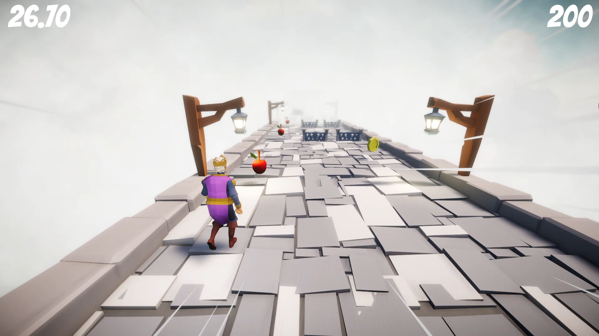
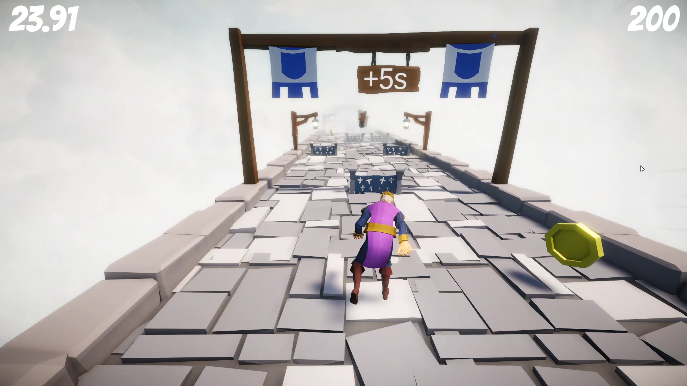
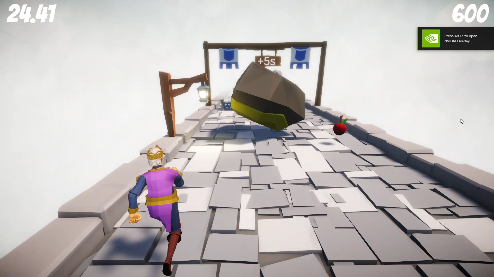
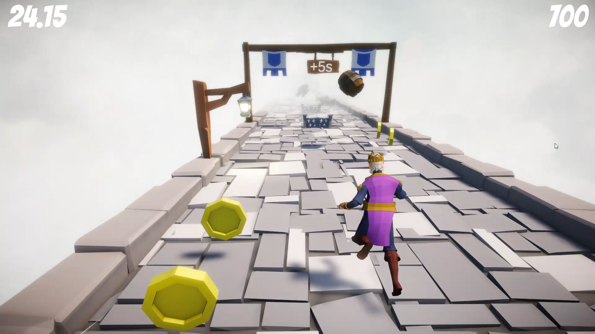
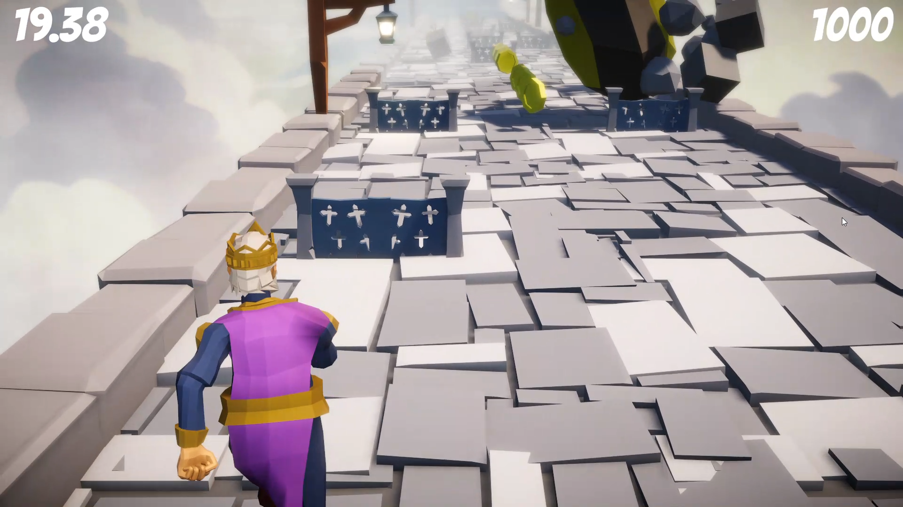
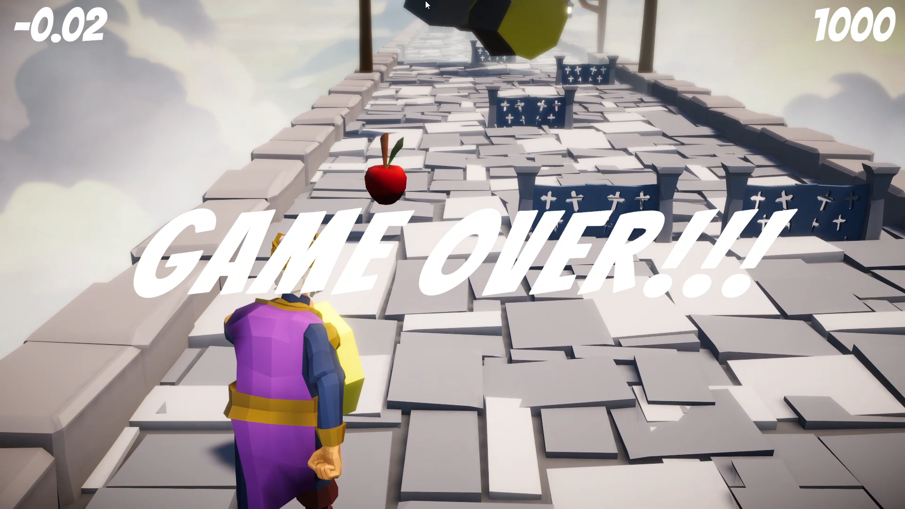

# Stone Run

A fast-paced survival runner where you navigate through procedurally-spawning obstacles while racing against time. Dodge rocks and fences, collect apples to extend your time, and see how long you can survive as the difficulty increases.

## Gameplay Preview




## Features

### 🎮 Core Mechanics
- **Time-Based Survival**: Start with limited time and race against the clock. Collect items to extend your survival
- **2D-3D Hybrid Movement**: Unrestricted vertical movement with constrained lateral movement (X-axis clamped)
- **Procedurally Generated Levels**: Infinite runner experience with dynamically spawned terrain chunks
- **Progressive Difficulty**: Game difficulty increases as you survive longer, with checkpoints triggering harder challenges

### 🏃 Player Controller
- **Responsive Movement**: Smooth physics-based movement with configurable speed and directional constraints
- **Animation System**: Character animations for collision/hit events
- **Hit Detection**: Collision cooldown system to prevent rapid-fire damage

### 🎯 Obstacle System
- **Varied Obstacles**: Multiple obstacle types (rocks, fences) spawn randomly across the playing field
- **Dynamic Spawn Rates**: Obstacle spawn frequency increases as you progress, reaching a maximum cap
- **Physics-Based Obstacles**: Full 3D physics interaction including rotation and collision effects
- **Collision Effects**: Particle systems and visual feedback on impact

### 📦 Pickup System
- **Apples**: Extend your time while also increasing game difficulty (faster obstacles)
  - Buff: Increases chunk move speed by 3x
  - Triggers camera FOV zoom effect for immediate feedback
  
- **Coins**: Collectible items that increase your score
  - Award 100 points per coin
  - No difficulty scaling effect

### 🎬 Camera System
- **Dynamic FOV Zoom**: Camera field of view smoothly adjusts based on game speed
  - Zoom range: 20° to 120°
  - Smooth 1-second interpolation for immersive speed feedback
  - Speed-up particle effects when accelerating
  
- **Cinemachine Integration**: Professional camera management with smooth follow behavior

### ✅ Checkpoint System
- **Periodic Checkpoints**: Appear every 8 chunks
- **Mechanics**:
  - Add 5 seconds to remaining time
  - Increase obstacle spawn speed (difficulty spike)
  - Serves as progression milestones

### 📊 UI & Management Systems
- **Game Manager**:
  - Time countdown display (formatted to 2 decimal places)
  - Game over detection and slow-motion effect (0.1x speed)
  - Player controller disable on game over
  
- **Score Manager**:
  - Real-time score tracking
  - Score freezes when game ends
  - Connected to coin pickup system

### 🌍 Level Generation
- **Infinite Terrain**: Chunks spawn ahead and despawn behind the player
- **Multiple Chunk Types**: Variety in terrain layouts including specialty checkpoint chunks
- **Physics Configuration**: Gravity adjusts dynamically based on game speed
- **Speed Range**: Movement speed capped between 2-20 units/second

### 🎨 Visual Effects
- **Particle Systems**: Collision impact effects with position-based spawning
- **Dynamic Camera Effects**: FOV zoom paired with particle burst on speedup
- **Rotating Pickups**: Visual rotation for collectible items

## Game Loop

1. **Start**: Player begins with 5 seconds on the timer
2. **Navigate**: Move left/right to dodge incoming obstacles (rocks, fences)
3. **Collect**: Pick up apples (extend time + increase difficulty) or coins (earn points)
4. **Progress**: Pass checkpoints every 8 chunks to gain time bonuses
5. **Challenge**: As difficulty increases, obstacles spawn faster and faster
6. **Survive**: Last as long as possible before time runs out
7. **Game Over**: Time reaches zero, game pauses, and final score is displayed

## Technical Architecture

### Project Structure
```
Assets/
├── Scripts/
│   ├── Managers/          (GameManager, ScoreManager)
│   ├── Player/            (PlayerController, CameraController, PlayerCollisionHandler)
│   ├── Procedural Generation/
│   │   ├── LevelGenerator
│   │   ├── Chunk
│   │   ├── Checkpoint
│   │   ├── ObstacleSpawner
│   │   └── ObstacleDestroy
│   ├── Pickups/           (BasePickup, Apple, Coin)
│   └── Rock.cs            (Physics interactions)
├── Scenes/
│   └── MainLevel.unity
├── Prefabs/
│   ├── Chunks/
│   ├── Falling Obstacles/
│   ├── Apple Pickup.prefab
│   └── Coin Pickup.prefab
└── Materials/
    └── [Physics materials]
```

### Key Systems
- **Input System**: New Input System (InputAction) for modern input handling
- **Physics**: Rigidbody-based movement with dynamic gravity
- **Animation**: Animator component for character reactions
- **UI**: TextMesh Pro for score and time display

## Controls

| Input | Action |
|-------|--------|
| WASD / Left Stick | Move character horizontally and vertically |
| Dodge obstacles | Survive longer |

## How to Play

1. **Avoid obstacles** coming toward you - they appear randomly across the screen
2. **Collect apples** to extend your time (but they make the game harder!)
3. **Collect coins** to boost your score
4. **Pass checkpoints** for bonus time when you reach them
5. **Survive as long as possible** before your time runs out
6. **Beat your high score** in future attempts!

## Development Notes

- Built with **Unity 6**
- Uses **Cinemachine** for advanced camera control
- Implements **procedural generation** for infinite gameplay
- Features **progressive difficulty scaling**
- Fully **physics-based gameplay**

---

## Gameplay Screenshots










